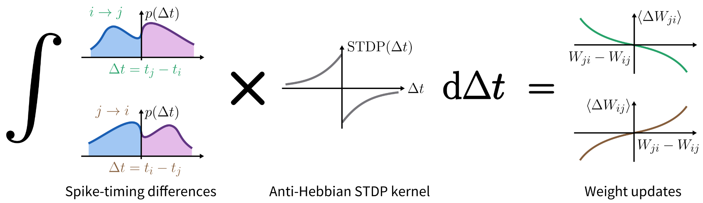

# Official code repository for the original spike-based alignment learning paper

<!--  -->
<!--  -->

## About this repository

This repository contains the official implementation for the paper
**"Weight transport through spike timing for robust local gradients"**
(Gierlich et al., 2025, [arXiv:2503.02642](https://arxiv.org/abs/2503.02642)).

The paper presents a solution to the well-known **weight transport problem** -- a long-standing problem in computational neuroscience and neuromorphic computing.
Many well-established learning algorithms from machine learning such as backpropagation require some form of weight symmetry, which effectively means that weight information has to be copied from one synapse to another -- an operation that violates locality in physical computing.

In our paper, we present **spike-based alignment learning (SAL)**, a missing peace for constructing purely local online learning rules for both the brain and brain-inspired spiking hardware.

This repository contains the python code to reproduce the experiments presented in the paper.
We demonstrate the effectiveness of SAL in various families of models:

- **Spiking sampling networks (SSN)**: In this spiking model for brain-inspired Bayesian inference, we show that SAL increases the robustness against parameter and plasticity noise 
- **cortical microcircuits**: In a spiking model for physically plausible error transport, SAL enables the alignment of feedback weights to the forward pathway, thus allowing the backpropagation of correct learning signal.
- **Deep convolutional networks**: A standard image classification task serves as framework to benchmark SAL against other spiking and non-spiking weight symmetrization algorithms

## How to set-up and run the simluations

### Requirements and dependencies

#### Software

The software is purely written in Python (>= 3.11) and requires the packages listed in [requirements.txt](requirements.txt).

#### Recommended hardware

- Modern multicore CPU with 8 cores and >8GB RAM
- For the SymmNet (deep learning) experiments, we recommend a GPU (the experiments in the paper were executed on Nvidia RTX4090)

### Setup

Typical setup time: ca. 5 min

1. Clone the repo (`git clone https://github.com/unibe-cns/sal-code.git` or `git clone git@github.com:unibe-cns/sal-code.git`) or create your own fork if you want to contribute to the project.
2. Setup you local **python environment** using you favorite tool:
  - The code is tested for python versions >= 3.11 only.
  - Using **`venv`**: `python -m venv --system-site-packages <name_of_env>` and activate it: `source ./<name_of_env>/bin/activate`
  - Or using **`conda`**: `conda create -n <name_of_env>` (it's recommended to add the python version: python=3.X) and activate it: `conda activate <name_of_env>`
3. Go to the repo `cd sal-code` and **install the dependencies**: `python -m pip install -r requirements.txt`
4. Register the ipykernel with `python -m ipykernel install --user --name sal`
(5. Install the **git pre-commit-hooks**: `pre-commit install.` This step is recommended if you want to contribute to the project).
6. Install the pip package for the STDD-calculator: `python -m pip install -e stdd_calculator`. This installs the package `stddc`.
7. Install the pip package for the spiking sampling network: `python -m pip install -e spiking_sampling_network`. This installs the package `neuralsampling`.
8. Install the pip package for the spiking microcircuits: `python -m pip install -e spiking_microcircuits`. This installs the package `microcircuits`.
9. Install the pip package for the symmnet deeplearning experiments: `python -m pip install -e symmnet`. This installs the package `symmnet`.

### Run the simulations for the paper:

The scripts for executing the experiments are located in ´scripts´.

#### Figure 2
  1. The spike-timing difference distributions (fig. 2c) are generated by the jupyter notebook `scripts/stdd.ipynb`.
  2. The weight evolution of the two neuron system (fig. 2d) and the phase plane diagram (fig. 2e) is generated by the jupyter notebook `scripts/ppd.ipynb`.
  
#### Figure 4 and 5
A minimal working example for a simulation of a spiking sampling network is provided by `scripts/ssn/train_bm.py` and the corresponding parameter file `minimnal_example.yaml`. It can be executed by `python train_bm.py minimal_example.yaml`.

To reproduce the raw data for figure 4 and five, the scripts and directories in `scripts/ssn` are available. A single simulation can be executed on a single CPU core and typically takes one to two hours. For each of the four experiment types (i.e. synaptic noise and plasticity noise scenario each with and without SAL), a total of 120 independent runs are required. We therefore recommend the simulations to be run in parallel on a HPC cluster. The raw data is then saved in the folder `results`.

Each subdirectory of `scripts/ssn/` contains a `exp.yaml` parameter file and a `change_params.py` python script. 
1. Execute `python change_params.py` to produce the parameter files for the parameter sweep acros different seeds and noise strengths.
2. Then run `bash launcher.sh` to start the simulations. It is recommended to start this through slurm with 120 parallel tasks.
3. The raw data can be plotted with `scripts/ssn/plot_fig.ipynb`.

#### Figure 6

A minimal working example for a simulation of a spiking microcircuits student teacher network is provided by `scripts/microcircuits/run.py` and the corresponding parameter file `example.yaml`. It can be executed by `python run.py example.yaml 0`.

To repoduce the raw data for figure 6, follow the same steps as for the sampling networks. 

In each subdirectory of `scripts/microcircuits`, do
1. `python change_params.py` to produce the parameter files for the 20 runs with different seeds.
2. Launch the runs with `bash launcher.sh`. The raw data is stored in `results/microcircuits`

The raw data can be plotted with `scripts/microcircuits/plot_fig.ipynb`.

#### Figure 7

To reproduce the data and plots for figure 7 (i.e., the weight scatter plots comparing two layers symmetrized by SAL, RDD and STDWI), execute the notebook `scripts/symm_net/scatter_stdwi_rdd_sal.ipynb`.

#### Figure 8

A minimal working example for the deep learning experiment is provided by `scripts/symm_net/main_salnet.py` and the corresponding parameter file `exp_setting.yaml`.

Usage: `python main_salnet.py -f exp_setting.yaml -s <type_of_experiment> --dataset <dataset> --tags <tag1,tag2>`

- `type_of_experiment`: choose the learning algorithm (equivalent to the section names in `exp_setting.yaml`)
- `dataset`: choose one the following datasets: `cifar10`, `svhn`, `mnist`, `fmnist`
- optionally, you can pass a list of descriptive tags to keep tack of your runs.

#### Figure 9

A minimal working example for the Time evolution of SAL in the SALNet is provided by `scripts/symm_net/salnet_symm.py`.

#### Figure 10

The "Dale's law" experiment can be reproduced by `scripts/dales_law/EI-system.ipynb`.

#### Figure 11

The data for figure 7 can be reproached by `scripts/psp_shapes.ipynb`. Note that this notebook typically requires a lot of memory.

#### Figure 12

Figure 8 can be reproduced by `scripts/plots_for_proof.ipynb`.

## Version history

See [CHANGELOG.md](CHANGELOG.md) for a full version history and changes between arXiv versions.
